# Crop-Pocalypse (CSCI 3300 Software Engineering Project)

## Overview

Crop-Pocalypse is an exciting game where players defend their farm against invading aliens. The game features multiple levels, each presenting unique challenges and increasing difficulty. Players must strategically move across the map and defend their crops from the alien invasion to progress through the game.

## Getting Started

To play Crop-Pocalypse, follow these steps:
Download GoDot v4.2.1
Clone the repository to your local machine.
Open GoDot application and press import
Open project.gotdot inside the src>view folder
Press run button on top right

## Compatiblity

Compatible on MacOS and Windows

## Model

### Model State

The game maintains a model state to keep track of various game elements such as the currentlevel, player status, and alien status.

### Character Class

The character class includes attributes such as setting and getting location, attack, and health of a character.

### Farmer Class

The farmer class inherits the Character class. And includes attributes that are essential for tracking the player's position and health throughout the game.

### Alien Class

The Alien class also inherits the Character class. Aliens are the primary adversaries in the game. The alien class defines characteristics and behaviors of the invading enemies.

### Grid Class

The game utilizes a system to determine whether a square on the game board is occupied and contains an enemy.

## View

### Prototype UI

The game features a prototype user interface (UI) designed to provide players with an engaging and intuitive gameplay experience. The UI elements include game controls, visual feedback, and essential information about the game state.

## Controller

### Main Method

The main method serves as the entry point for the game, orchestrating the initialization of game components and starting the gameplay loop.
Level Management: The controller includes methods to handle different game levels, such as Level 1, Level 2, and Level 3. Each level presents unique challenges and progression criteria for the player.

